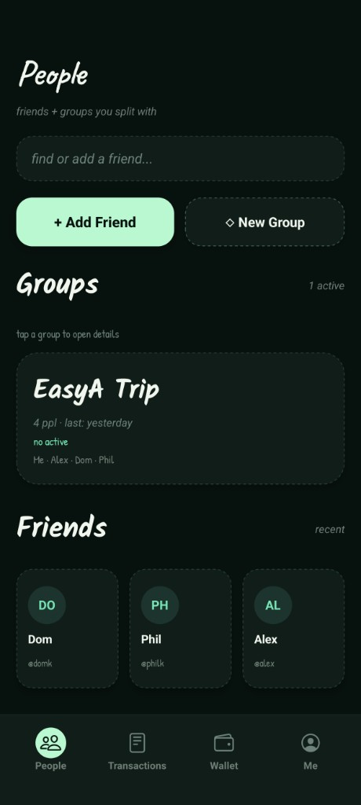
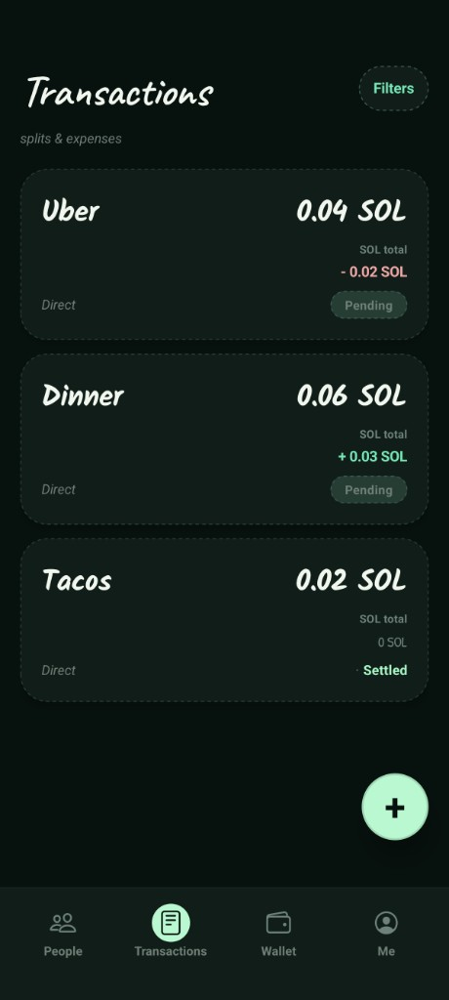
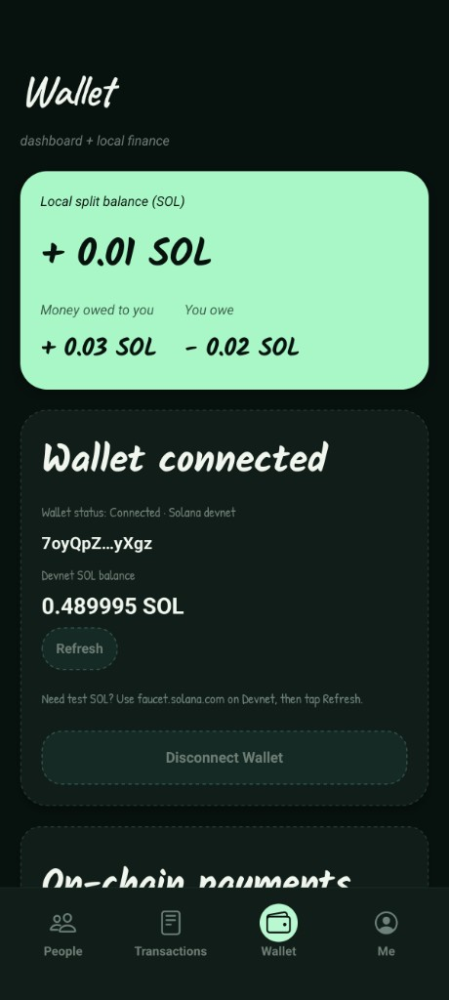
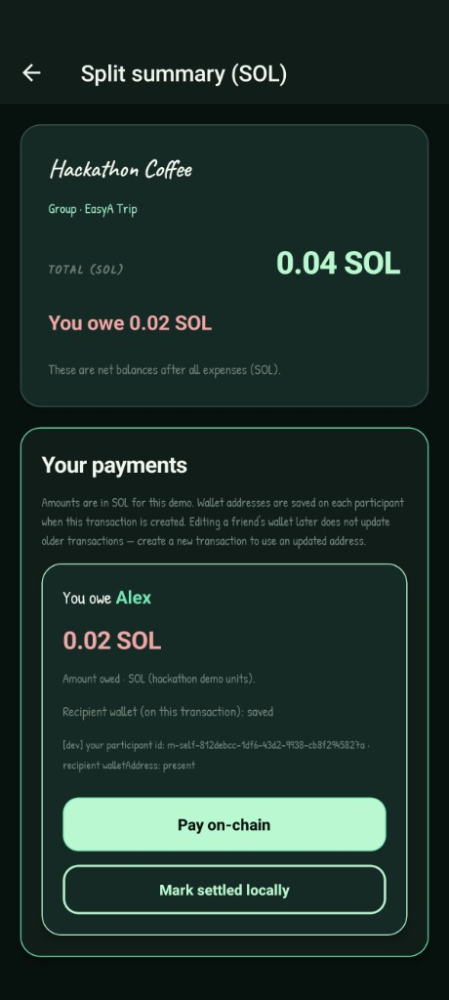

# SplitSol

SplitSol is a Solana Mobile expense splitter that helps crypto users create groups, track shared costs, calculate who owes who, and settle balances on-chain using wallet signing.

Built for the **EasyA Consensus Miami Hackathon - Solana Mobile Track: Build for the dApp Store**.

## Demo Video

[Watch the demo video here](https://www.loom.com/share/cd162aa1689f4665bfcf7854bb97dafb?t=4)


This video explains:

- What SplitSol does
- How the app works
- How Solana Mobile Wallet Adapter is used
- How the on-chain payment flow works

## Screenshots

### Friends & Groups



### Transactions



### Wallet



### Transaction Detail / Pay On-Chain



## Problem

Splitting expenses with friends is still messy.

People pay for different things like dinners, Ubers, hotels, trips, and shared purchases. Later, everyone has to figure out:

- Who paid?
- Who was included?
- Who owes who?
- Did everyone agree with the transaction?
- Did the balance actually get settled?

For crypto users, there should be a mobile-first way to track these shared expenses and settle balances directly from a wallet.

## Solution

SplitSol is a mobile-first expense-sharing app built for Solana Mobile.

Users can:

- Add friends
- Create groups
- Create direct transactions
- Add shared expenses
- Automatically calculate balances
- Accept or dispute participation in a transaction
- Connect a Solana wallet
- View devnet SOL balance
- Pay eligible balances on-chain
- Save the transaction hash after settlement

For the hackathon demo, transaction amounts are entered directly in SOL so the full on-chain settlement flow can be shown clearly on devnet.

## How It Works

Example flow:

1. User connects a Solana wallet on the Seeker phone.
2. User adds a friend with a wallet address.
3. User creates a direct transaction or group transaction.
4. User adds an expense, such as `0.02 SOL` paid by Alice.
5. SplitSol calculates that the current user owes Alice `0.01 SOL`.
6. User taps **Pay on-chain**.
7. The wallet opens through Mobile Wallet Adapter.
8. User approves the transaction.
9. SplitSol confirms the devnet transaction.
10. The balance is marked as settled and the transaction hash is saved.

## Blockchain Interaction

SplitSol uses Solana Mobile Wallet Adapter to connect and sign transactions from a mobile wallet on the Seeker device.

The blockchain flow works like this:

1. The user connects their wallet through **Solana Mobile Wallet Adapter**.
2. SplitSol stores and displays the connected wallet address locally.
3. The app fetches the wallet's **devnet SOL balance** using `@solana/web3.js`.
4. When the user pays a balance, SplitSol builds a Solana devnet transfer transaction.
5. The transaction is sent to the wallet for signing through Mobile Wallet Adapter.
6. After approval, the transaction is submitted to Solana devnet.
7. SplitSol confirms the transaction and saves the transaction hash on the balance entry.
8. The balance row is marked as settled in the app.

This satisfies the Solana Mobile Track requirement because the app is an Android mobile app that uses the Solana network meaningfully and integrates Mobile Wallet Adapter for wallet signing.

## Solana Mobile Features Used

- Solana Mobile Wallet Adapter
- Wallet authorization
- Wallet signing
- Solana devnet transactions
- Devnet balance fetching
- Android custom development build
- Tested on Seeker phone

## Tech Stack

- React Native
- Expo
- TypeScript
- EAS Build
- Solana Mobile Wallet Adapter
- `@solana/web3.js`
- AsyncStorage
- Solana devnet

## Repository Structure

```text
src/
  components/       Reusable UI components
  constants/        Shared app constants
  hooks/            App state and wallet hooks
  lib/              Core helpers, balance logic, and Solana utilities
  navigation/       App navigation stacks and tabs
  screens/          Main app screens
  types/            TypeScript data models
```
